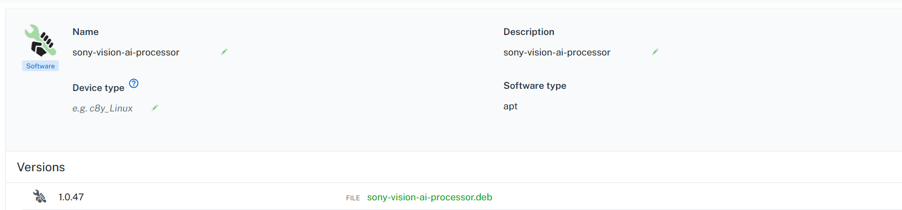
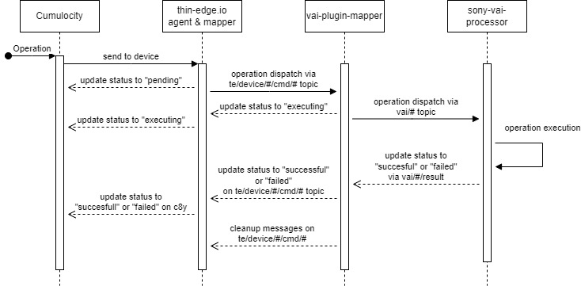
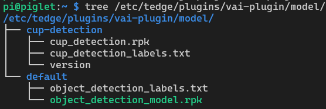
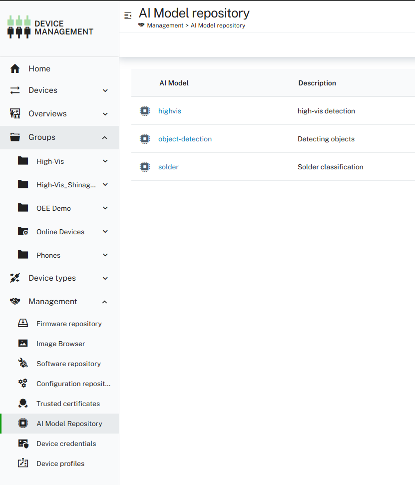
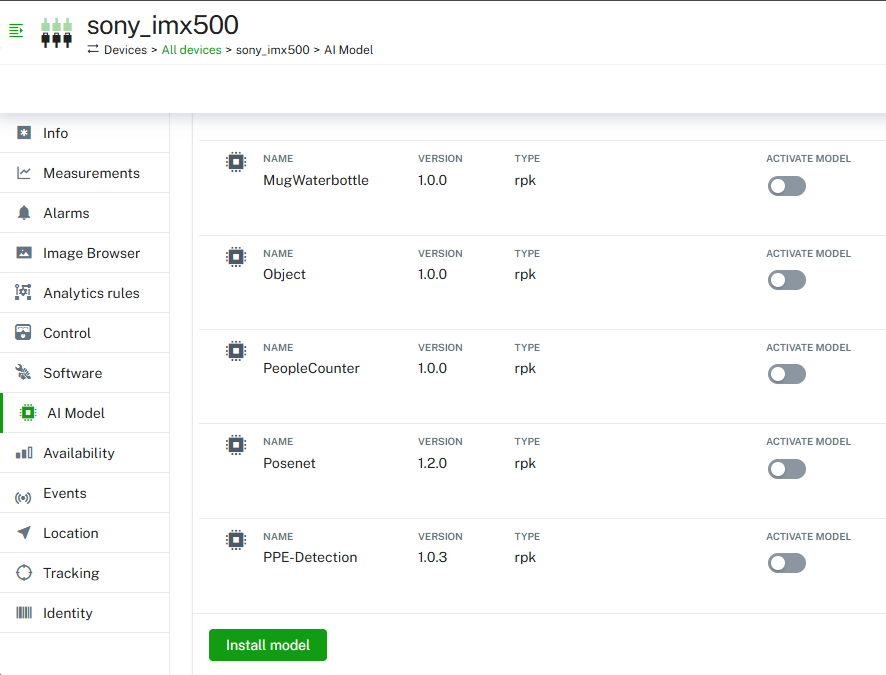

# Raspberry PI Vision AI Processor

This project provides a thin-edge.io plugin that supports **classification**, **object detection** using the IMX500 Vision AI capabilities on the Raspberry Pi AI Camera. The script has been packaged as a **Debian package** and can be deployed on a **Raspberry Pi**.


## Usage

### Deploying 
Make sure thin-edge.io is installed on the target device and connected to Cumulocity.

The plugin can be deployed via [**Cumulocity Software Management**](https://cumulocity.com/docs/device-management-application/managing-device-data/#managing-software) using `apt` as software type. 



For a "manual" installation just copy the deb package to your device and install it via apt, dpkg etc. 

## Basic Setup

The plugin consists of two components: 
* The **vision-ai-mapper** takes care of interacting with thin-edge and Cumulocity. 
* The actual (camera-specific) code for running models and executing the operations is in the **rpi-vision-ai-processor** 

The split between mapper and processor has been made to keep the reusable part of interacting with thin-edge and Cumulocity from the 
device specific plugin for the camera. This also allows to trigger operations on the processor without having to interact with the 
thin-edge.io or Cumulocity API

Both components are installed as systemd services during setup. The default installation also adds some other files:

* **/etc/tedge/plugins/vai-plugin** Base configuration location of the plugin
  * plugin_config.yaml: Main plugin configuration (mainly MQTT and topics)
  * camera_config.yaml: Per-camera settings like id and framerate 
  * logging.conf 
* **/etc/tedge/plugins/vai-plugin/model/** Model repository with RPK and label files
* **/var/log/tedge/vai-plugin/** Default log location

## General operation flow

All operations use the same basic flow across the different components. We re-use the mapping capabilities of thin-edge.io to 
interact with Cumulocity. The vai-mapper and processor communicate via plugin-specific MQTT topics. (see list below) 



## Model Management

### Model Files
The folder /etc/tedge/vai-plugin/model works as local "repository" for all available models on the device.
The setup assumes that a model network (ending with *.rpk) and it's label file (ending with *.txt) 
are put under a folder in /etc/tedge/vai-plugin/model. The folder has the same name as the model and a "version"
file that contains the current version of the model.
E.g. for a model named "cup-detection" the tree looks like something like this:


The version file is optional and used for model management via Cumulocity. Any folder without it won't be 
recognized as manageable model.

Additionaly, as **metadata.yaml** can be added to the folder. This can be used to overwrite any of the settings in the metadata section of the camera_config.yaml. It is intended to package model-specific details (type, post-processing steps, framerate) with the model.

### Deploy Model

To make a model available to the camera(s) it needs to be placed into the model repository folder like described in the previous section. This can be done by just by creating the required folder and copying the rpk, label txt and metadata.yaml file to it.

For more convenience, this can be also done via the Cumulocity AI Model Management plugin under *Device Management* -> *Management* -> *AI Repository*

Package all required files (rpk, label, metadata) into a *.zip and upload it to the AI Repository as rpk type.



The AI model then can be installed to the device remotely. Go to your device and the *AI Model* tab of the registered camera.
You can install models from the Cumulocity AI Repository to your device. The plugin will pick up the zip and extract it to a local model folder.


Once installed, the model will appear and can be activated from the same screen. 

Note that deploying a model to a device does *not* automatically activate it on any attached camera. 

### Activate Model

The actual execution of the model network is started by choosing a model for the camera. This can be done by 
setting the imx500/model property to the name of the model in the camera_config.yaml.
The model folder must exist in the local repository, and it must contain the network (rpk) file and the label text.
The plugin will watch the config files and automatically upload the network file to the chip.

This operation can be triggered by a Cumulocity c8y_ActivateModel operation. The model to be activated must be given
as c8y_ActivateModel.model and it must exist in the local repository. That is a folder with the same name must exist under
*/etc/tedge/plugins/vai-plugin/model/*

````json
{
    "deviceId": "<cameraId>",
    "c8y_ActivateModel": {"model":"cup-detection"},
    "description": "Activate model"
}
````


## Configuration

All basic configuration is available in the *plugin_config.yaml*. This includes the connection to the broker, as well as the topic names. As long as you haven't made changes to the default thin-edge.io broker, this should be fine with the defaults:

### Base
**plugin_config.yaml**
```yaml
mqtt:
  broker: "127.0.0.1"
  port: 1883
  keepalive: 60
  topics:
    base: "imx500"
    detection: "detection"
    classification: "classification"
    status: "CameraServiceStatus"
  client_id: "imx500_ai_camera_publisher"
```

### Model

All camera and model-specific configuration is part of the camera_config.yaml. The values in this file will be overwritten by values in the metadata.yaml file that is part of the model zip file.

**camera_config.yaml**
```yaml
cameras:
  camera:
    id: "ai_camera"
    metadata:
      model: cup-detection # name of the model as in the local repository (folder name)
      framerate: 15
      threshold: 0.3
      modeltype: object detection  #either "object detection" or "classification"
      bbox_normalization: False
      bbox_order: yx
      output_order: bscn #bscn or bcsn
      max_detections: 5
    tracker:
      track_thresh: 0.25
      track_buffer: 30
      match_thresh: 0.8
      aspect_ratio_thresh: 3.0
      min_box_area: 1.0
      mot20: False

```

It is intended to support multiple cameras at some point of time, hence this is a dictionary. The **metadata** section contains all model-relevant parameters.
The **tracker** section is only relevant for object detection models. It configures the ByteTrack algorithm to set the tracker_ids on the detected objects.


## Other Supported Operations
### Image Capturing
Create an operation of type "c8y_ImageCapture". 
```json
{
    "deviceId": "<cameraId>",
    "c8y_ImageCapture": {},
    "description": "Take a picture"
}
```

The picture will be taken from the current stream of images used for inferencing. I.e the size will be the same.
The captured image will be uploaded (via tedge upload ) as a Cumulocity event attachment.
It can be viewed by e.g. going to the event list for the device and checking the attachment.
```json
 {
      "c8y_IsBinary": {
        "length": 1739187,
        "name": "tmp_20250412194322.jpg",
        "type": "image/jpeg"
      },
      "creationTime": "2025-04-12T17:43:23.736Z",
      "source": {
        "id": "8225322204"
      },
      "text": "Uploaded file: \"/tmp/tmp_20250412194322.jpg\"",
      "time": "2025-04-12T17:43:23.684Z",
      "type": "c8y_CameraImage"
    }
```


### Video Capturing

This works similar to image capturing, just with the *c8y_VideoCapture* type. The c8y_VideoCapture fragment also allows optional framerate (in fps) and duration (in seconds) parameters.
```json
{
    "deviceId": "<cameraId>",
    "c8y_VideoCapture": {
      "framerate": 15.0,
      "duration": 10.0
    },
    "description": "Take a video"
}
```

This will record and produce an mp4 file which will be stopped and uploaded after <duration> seconds. 

## Used topics 
| Topic                                  | Description                                         | Content                                                            |
|----------------------------------------|-----------------------------------------------------|--------------------------------------------------------------------|
| vai/<camera-id>/image/<op-id>          | incoming image operation used by camera-plugin      | The Cumulocity Operation (see ImageCapture)                        |
| vai/<camera-id>/image/<op-id>/result   | outgoing result of image operation                  | An operation result with the filename as result or an error reason | 
| vai/<camera-id>/model/activate/<op-id> | topic for informing the camera plugin about activating a model | model name                                                         |
| vai/<camera-id>/model/activate/<op-id>/result | topic for the activation result                     | An operation result with the model name as result or error reason  |                                      


## Output

The topics for the detection and classificaton results follow the structure <base>/<child-id>/<topic>. The <base> and <topic> can be configured
as part of the plugin_config.yaml. Change this only to avoid any conflicts with other consumers.
The <child_id> is camera/id in the camera_config. This is to potentially support multiple camera childs in a future release.

### Topics and structure
| Topic                                                         |Description| Content                |
|---------------------------------------------------------------|-----------|------------------------|
| imx500/<child_id>/detection/<model>                           | Result channel for detections | object detection event | 
| imx500/<child_id>/classification/<model>                      | Result channel for classifications | object classification event|
| imx500/<child_id>/CameraServiceStatus                         | Camera Service Events | {  "status": "Service started"}|
| te/device/main/service/rpi-vision-ai-processor/status/health | Current health ||

### Object detection 

This is an array of Detecetion objects.

```JSON
{
  "frame_id": 91208,
  "timestamp": "2025-06-18T23:01:53.414736",
  "detections": [
    {
      "category": 1,
      "label": "Person",
      "conf": 0.92,
      "box": [120, 80, 200, 160]
    }, {
      "category": 1,
      "label": "Cup",
      "conf": 0.68,
      "box": [180, 120, 30, 40]
    },
    ...
  ]
}
```

### Object classification:
```JSON
  "frame_id": 91208,
  "timestamp": "2025-06-18T23:01:53.414736",
  "detections": [
    {
      "index": 0,
      "label": "No Helmet",
      "score": [0.87, 0.98, 0.67]
    }
  ]
}
```


## Show Preview Window ##

**Note:** This configuration is mainly useful for demo installations and debugging. Displaying the frames on a screen will decrease the performance, requires increased privileges and may cause issues.

You need to change the systemd service as well as the plugin_config.yaml:

1. Enable the service to use the display session of your user

    * edit */etc/systemd/system/rpi-vision-ai-processor.service* - you might have to use sudo to make sure you have enough rights
    * Comment in the Environment Variables to allow the display sharing with your pi user
      ```bash
      Environment="DISPLAY=:0"
      Environment=XAUTHORITY=/home/pi/.Xauthority
      ```
    * Update the User to be root (instead of tedge) 
      ```bash
      User=root
      ````
    * Save the file
    * reload the systemctl daemon:
      ```bash
      sudo systemctl daemon-reload
      sudo systemctl restart rpi-vision-ai-processor
      ```
2. Set the plugin to use the preview window
    * edit */etc/tedge/plugins/vai-plugin/plugin_config.yaml*
    * add ``show_preview: true`` (for window) or ``show_fullscreen: true`` (for fullscreen) at the end of the file and make sure to not have any whitespace before it
    * save the file
    
## Building the Debian Package
Make sure **Docker** is installed. The build will setup emulation for arm32/64 and create docker images that are used as build containers on your machine

This project uses **just** as build system. You can download it for all kind of platforms:

https://just.systems/man/en/packages.html


To build a deb just run the justfile with a target (from root directory of project):
```shell
just build-arm32
```

Available targets in the justfile:

* build-arm32
* build-aarch64
* build-all

##  Licensing
This project is licensed under the Apache 2.0 license - see https://www.apache.org/licenses/LICENSE-2.0

These tools are provided as-is and without warranty or support. They do not constitute part of the Cumulocity product suite. Users are free to use, fork and modify them, subject to the license agreement. While Cumulocity GmbH welcomes contributions, we cannot guarantee to include every contribution in the master project.


## Next Steps
- Additional documentation will be added.

Stay tuned for further updates!


